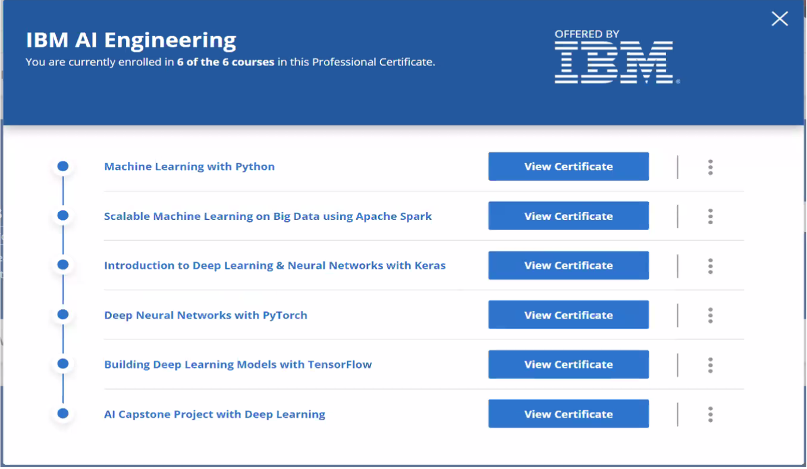
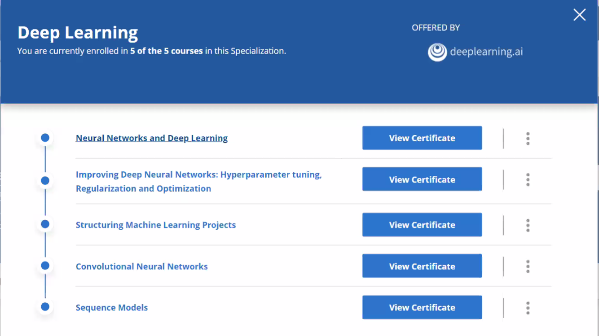
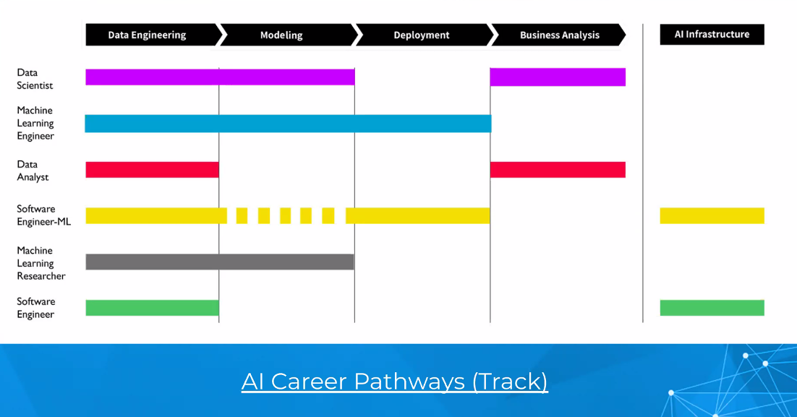
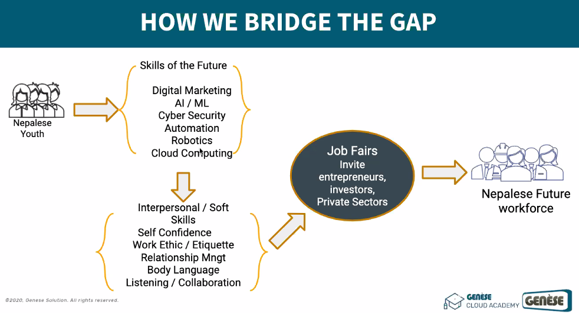
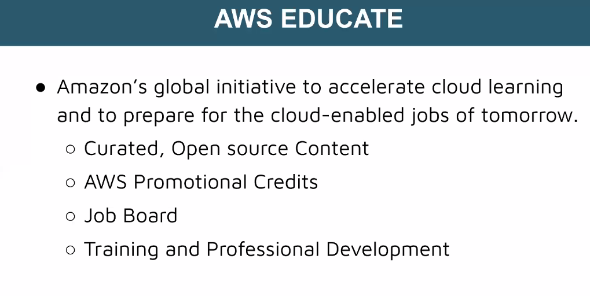

1. AI used in

   - mail span
   - recommendation in ecommernce
   - people dont know what they want untill you show them
   - friend suggestion
   - feed in fb
   - avtarify
   - prediction while writting
   - reinforcement
   - open ai

2. We must use ai in any project
3. AI is future in anything

4. Company in Nepal

   - Fusemachine
   - Paaila technology
   - Naamii
   - leapfrog
   - Docsumo

5. AI project in python
   - website / mobile app -> api
6. To learn

   - Linear algebra
   - probability and statictics
   - calculus
   - numerical optimization

7. IBM Ai Engineering Courses

   - 

8. Deep learining courses

   - 

9. IBM Data Science Professional Certificate

   - What is data science.
   - Tools for data science.
   - Data science Mehtodology.
   - Python for data science and AI.
   - Database and SQL for data science.
   - Data analysis with python.
   - Data Visualization with python.
   - Machine learning with python.
   - Applied Data science Capstone.

10. Coursera courses for AI and Data Science

    - Python for Everybody - michigan university
    - Machine learning - standord university
    - Ai for everyone - deeplearning.ai
    - data science math skill - duke university
    - mathematics for machine learning - imperial college london
    - machine learning specialization - washington university

11. Career pathway

    - ui/ux design
    - frontend development
    - digital marketing
    - Business analyst/product management
    - quality assurance
    - cyber security
    - web development
    - content writing
    - IT human resources
    - MIS audit
    - MIS officer
    - machine learning scientist

12. Ai career pathways

    - 

13. Cloud Career pathways

    - cloud computing 101
    - application developer
    - cybersecurity specialist
    - data integration specialist
    - data scientist
    - devops engineer

14. Nepelse Future

    - 

15. AWS Educate

    - 

16. Future Jobs

    - 34% -> Mobile internet, cloud technology
    - 26% -> processing power, big data
    - 22% -> new energy supplies and technologies
    - 14% -> Internet of things
    - 12% -> sharing economy,crowdsourcing
    - 9% -> robotics,autonomous transport
    - 7% -> ai
    - 6% -> adv. manufature,3d printing
    - 6% -> adv.material, biotechnology
