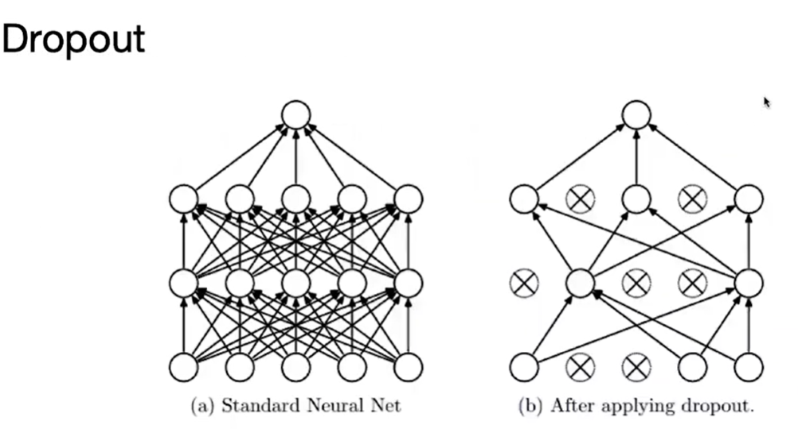
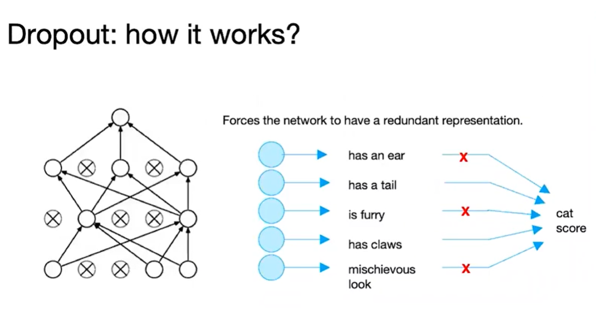

# Batch Normalization

1. Improves gradient flow through the network.
2. Allows higher learning rates.
3. Reduces the strong dependence on inialization.
4. Acts as a form of regularization in a funny way, and slightly reduces the need for dropout, maybe

# Dropout

1. Dropout is a regularization method that approximates training a large number of neural networks with different architectures in parallel.

2. During training, some number of layer outputs are randomly ignored or "dropped out". This has the effect of making the layer look-like and be treated-like a layer with a different number of nodes and connectivity to the prior layer. In effect, each update to a layer during training is performed with a different "view" of the configured layer.

   - 

     > Dropout is training a large ensemble of modesl.
     > Each binary mask is one model, gets trained on only~one batch.

   - 
