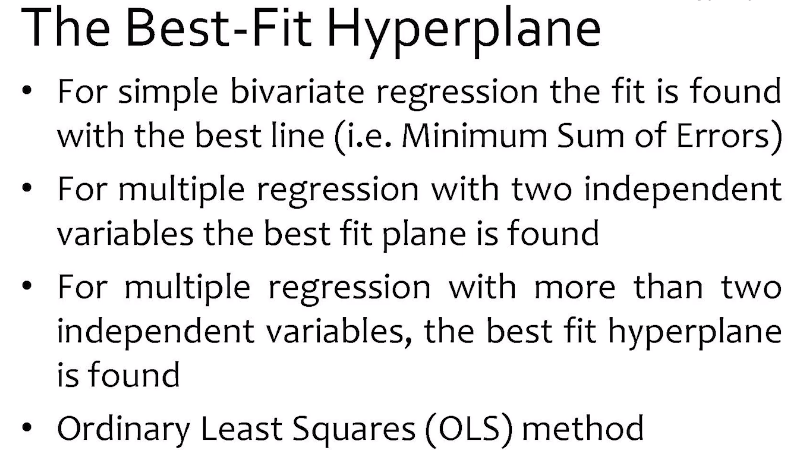
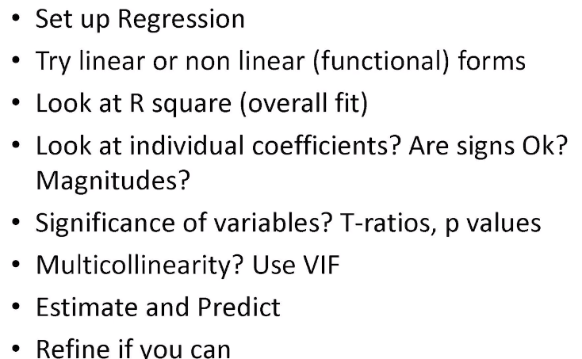

# Model

    Model is a description of a reality.
    -> Graphic, equation, algorithm.

    As said, all model are wrong, some model are usefull.

    Model is always based on assumption and invlove simplification.

        - The specific assumption of a model , it must be carefully laid out, so that we can assist as to whether those assumptions are at least approximatly valid or whether they make the current application of the model impractical.
        - Secondly, simplification, why do we simplify things? Typically because th ecomplexities of the real world scenario are likly to overwhelm the faily simple logic that a computer tends to follow.

#

> 

> 

> 

> 

#

# Predictive Modelling

> 

> 

#

#

> # Check List

> 
