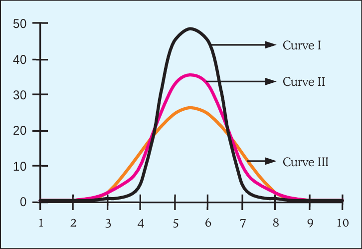
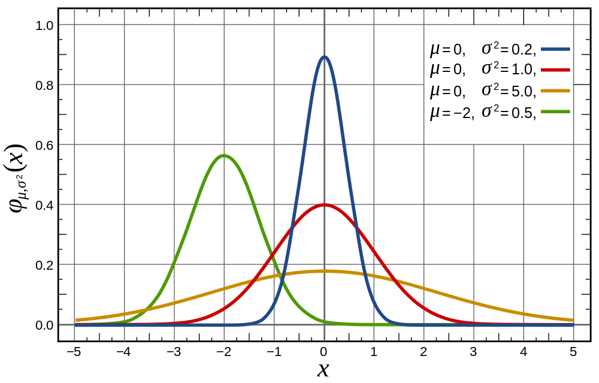

# Annova

    # Hypothesis of One-Way ANOVA

    Ho: = u1=u2=u3=u4....=uk
    All population means are equal

> 

    Ha : Not all of the population means are equal.
    For at least one pair, the population means are unequal.

> 

# One way ANOVA:

• The one-way analysis of variance (ANOVA) is used to determine whether there are any statistically significant differences between the means of two or more independent (unrelated) groups

• For one-way ANOVA, the ratio of the between-group variability io the within-group variability follows an F-distribution when the null hypothesis is true. When you perform a one-way ANOVA for a single study, you obtain a single F-value
