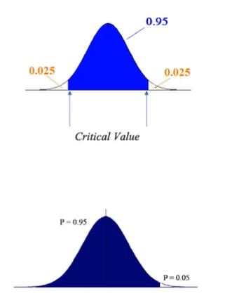

# Confidence Intervals

    95% of all sample means (x bar) are hypothesized to be in this region.
    This is called as 95% confidence interval.

    If sample mean is in the blue region, we fail to reject the null hypothesis.
    If sample mean is in the white region, we reject the null hypothesis.

    Here , alpha = 0.05
    apha is the level of significance or our tolerance level towards making a Type 1 error.

    If the null hypothesis is correct, (alpha * 100)% of the sample means should lie in the rejection region.

    In case of one-tailed situation.
    All of alpha is in one tail or the other, depending on the alternative hypothesis.
    Ha points to the tail, where the critical value and the rejection region are.
    ( Case when observed mean > hypothesized mean)

> 

