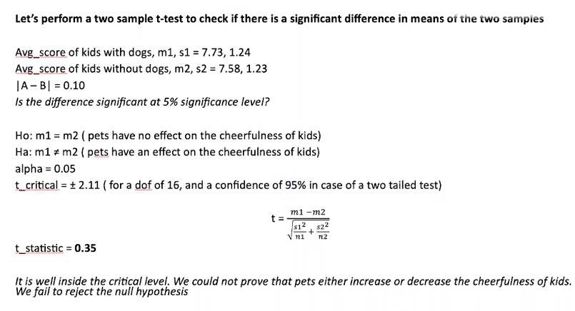
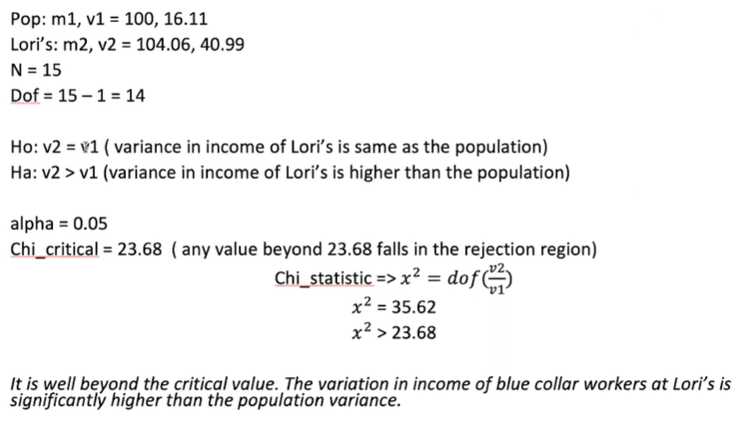
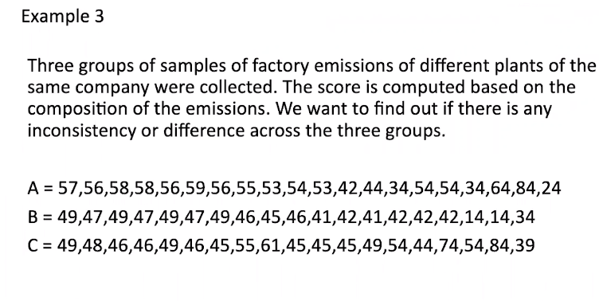
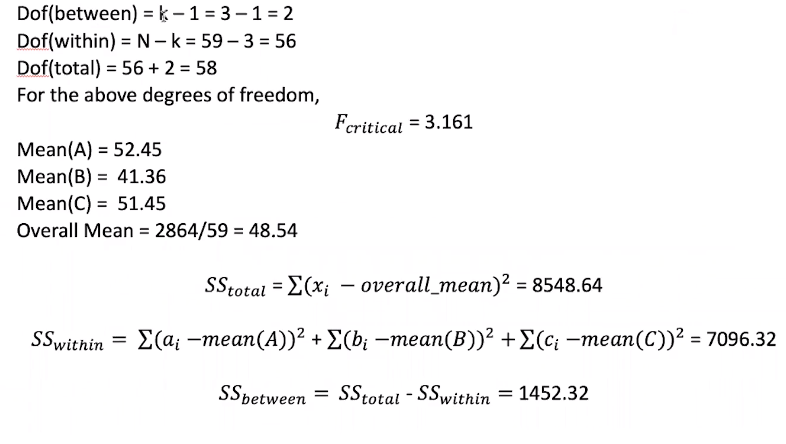
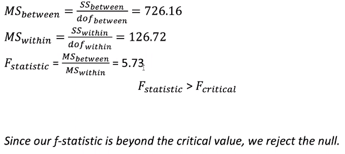
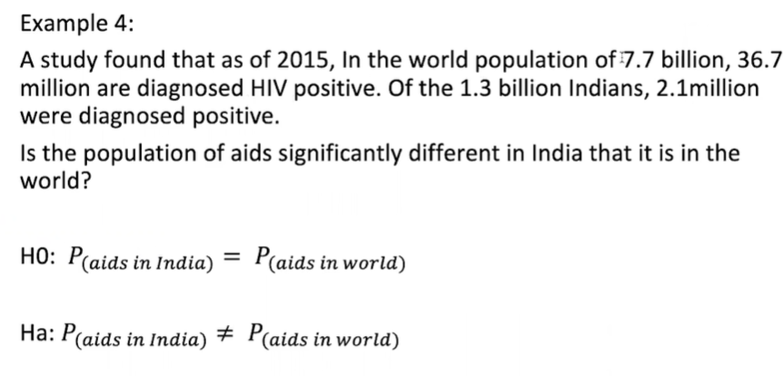
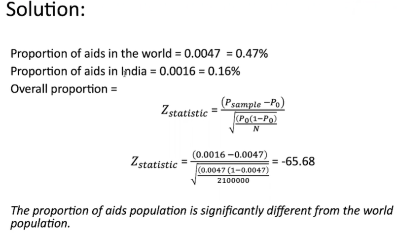

## Example 1

    A study was done to see the effect Of presence Of dogs as pets on kids (ages 10 to 18). Two groups Of teenagers, one group with teenagers who owned a dog for minimum 5 years and another group of kids who never owned a dog, were presented a questionnaire and scores were computed. High score corresponds to higher cheerfulness and low score corresponds to lower cheerfulness.

    Do dogs have a significant effect (either positive or negative) on the cheerfulness of kids?

    Dog: 6.6, 7.8, 46, 7.8, 7, 8, 9, 9, 8.8, 9.9, 8.5, 77, 8.6, 8, 7, 5.8, 7.4
    No_dog: 9.8, 8.3, 7.1, 7.2, 8.1, 8.9, 6, 7, 7.5, 7.8, 7.6, 7.3, 6.4, 6.8, 7, 6.4, 7.9

     What are the null and alternative hypothesis?
      Is it a right tailed or a left tailed test?
      Is it a one sample or a two sample test?
      Is it a test of mean, proportion or variance?
        - Mean
      Which statistical test do you think is appropriate?

> 

## What just happened:

    • The test we just performed is called as 2-sample t-test or Independent samples t-test or student's t-test.
    • We perform this test to see if there is a statistically significant difference between means of two independent groups.
    • The null hypothesis will be that there is no difference in means
    • The alternative hypothesis will be that there is a significant difference in means
    • To perform this test, we will need one independent qualitative variable with two levels and one dependent quantitative variable.

# Example 2

    The following is the income data of blue collar workers who are at the same skill level. There are two groups of workers. Workers of the textile company "Lori's and Co." and workers of the general population. We want to check weather the variance in the income of Lori's is higher than of the general population.

    Mean and variance of general population = 100, 16.11

    Lori's : 105, 95, 90, 98, 110, 104, 108, 111, 110, 102, 98, 105, 105, 105, 115

    What are the null and alternative hypothesis?
    Is it a right tailed or a left tailed test?
        - Right
    Is it a test of mean, proportion or variance?
        - Variance
    Which statistical test do you think is appropriate?

> 

#

> 

> 

> 

#

> 

> 
