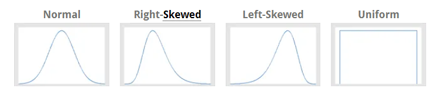

# Central Limit Theorem

    - " Sampling Distribution of the mean of any independent random variable will be normal "
    - This applies to discrete and continuous distributions.
    - The random variable should have a well defined mean and variance (standard deviation).
    - Applicable even when the original variable is not normally distributed.

> An essential component of the Central Limit Theorem is that the average of your sample means will be the population mean. In other words, add up the means from all of your samples, find the average and that average will be your actual population mean. Similarly, if you find the average of all of the standard deviations in your sample, you’ll find the actual standard deviation for your population. It’s a pretty useful phenomenon that can help accurately predict characteristics of a population. Watch a video explaining this phenomenon, or read more about it here: The Mean of the Sampling Distribution of the Mean.

> The central limit theorem in statistics states that, given a sufficiently large sample size, the sampling distribution of the mean for a variable will approximate a normal distribution regardless of that variable’s distribution in the population.

> Unpacking the meaning from that complex definition can be difficult. That’s the topic for this post! I’ll walk you through the various aspects of the central limit theorem (CLT) definition, and show you why it is vital in statistics.

## Distribution of the Variable in the Population

> Part of the definition for the central limit theorem states, “regardless of the variable’s distribution in the population.” This part is easy! In a population, the values of a variable can follow different probability distributions. These distributions can range from normal, left-skewed, right-skewed, and uniform among others.

> 
