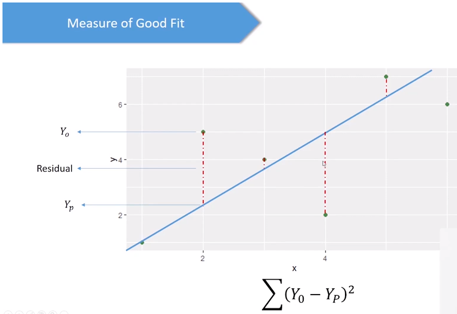

# Linear Regression

    Regression Analysis helps us to understand the relationship between two or more variables by creating a predictive model.

    Y = f(x)
                where, Y = Dependent Variable
                       x = Independent Variable

## Linear Regression

    Linear Regression is a predictive model used for finding the linear relationship between a depended variable and one or more independent variables.

    Y = a + bx
                where, Y = Depended Variable is continuous numerical value
                       a = intercept of line in y axis / x
                       b = coefficient of x / slope of line
                       x = independent variable

> 

> 

> 

#
# Multiple Linear Regression
    In mutiple linear regression, we have one dependent variable and more than one independent variables.

> 
    Y = Miles per galons  | x1 = weight  | x2 = horse power  | x3 = cylinders